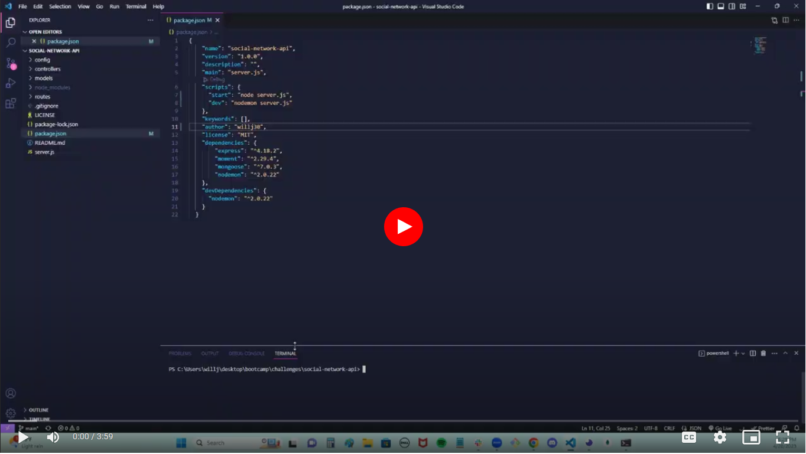

# team-profile-generator
  
  
 

  ## Description
  In this application, I have created a social network api using NoSQL and MongoDB so that users can share their thoughts, react to friends' thoughts, and create a friend list.
  
  ## Table of Contents
  * [Description](#description)
  * [Installation](#installation)
  * [Usage](#usage)
  * [License](#license)
  * [Contribution](#contribution)
  * [Questions](#questions)
  

  ## Installation
  For this application to work, you will need to clone it then run npm install.
  
  ## Usage
  In the command line interface, run npm start after running npm install and use an application like insomnia to test get, post, put, and delete requests.

Demonstration:

 
 

  ## License
  The license this project is under is MIT. For more information, please click the link below:

  https://opensource.org/licenses/MIT
  
  ## Contribution
  Feel free to reach out to me on GitHub.
  
  
  ## Questions
  Any Questions? You can email me at willjaramillo30@gmail.com
  Or, reach out to me on GitHub at https://github/willj30